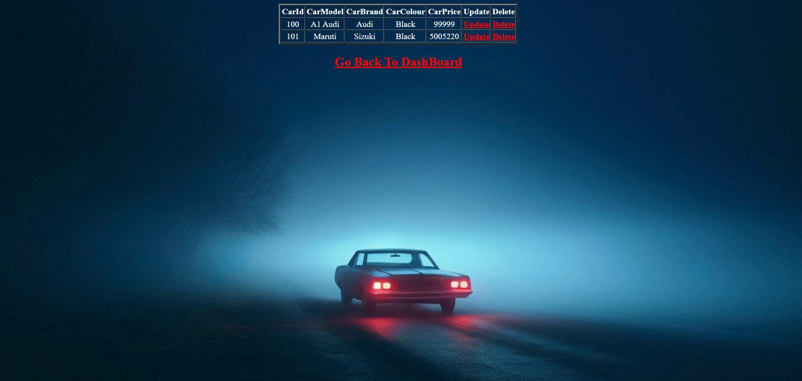

## Car Database Management System

Overview

The Car Database Management System is a web-based application designed to streamline car inventory management. It features comprehensive CRUD operations, allowing users to efficiently manage car records with attributes such as Car ID, Car Model, Car Brand, Car Color, and Car Price. The application offers a user-friendly interface with robust validation mechanisms to ensure data integrity and security.

## Features

Comprehensive CRUD Operations: Create, Read, Update, and Delete car records.

Intuitive JSP-Based UI: User-friendly interface with dynamic JSP pages.

Form Validation: Ensures accurate data entry and enhances security.

Servlet-Based Processing: Efficiently handles HTTP requests (GET, POST).

MySQL Integration via JDBC: Secure and optimized data storage.

Optimized SQL Queries: Enhances data retrieval efficiency.

Pagination Support: Ensures a highly responsive user experience.

Cloud-Based Contact Management: Securely manages personal and professional contacts.

## Tech Used

🎨 Frontend: JSP, HTML, CSS, Bootstrap

🎨 Backend: Java Servlets

🎨 Database: MySQL (JDBC integration)

🎨  Development Tools: Eclipse. Apache Tomcat

Installation & Setup

Prerequisites:

Java JDK 8 or later

Apache Tomcat Server

MySQL Database

JDBC Driver

### Expected Output

